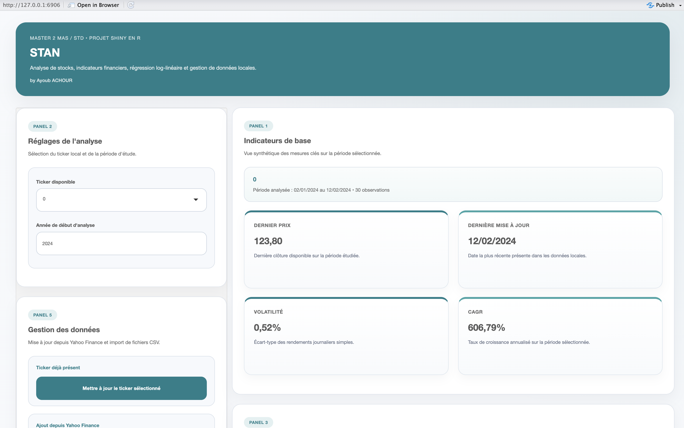
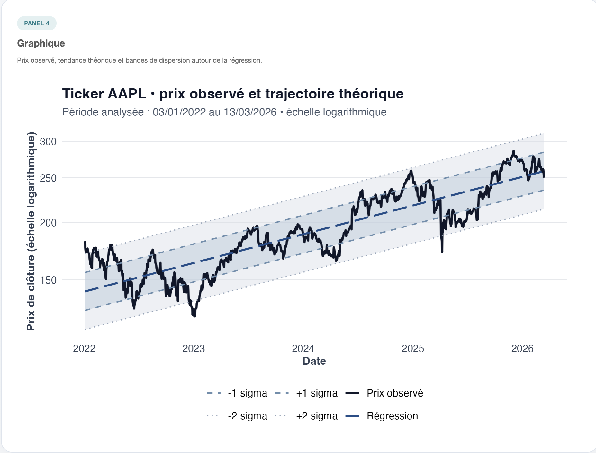
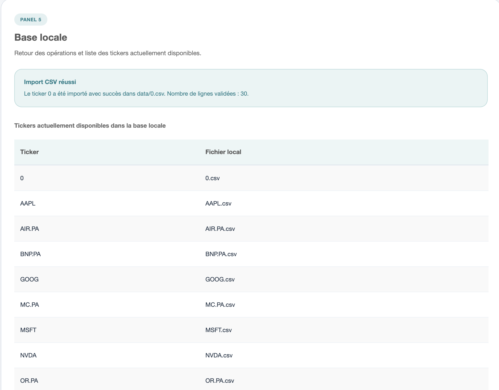

```{r setup, include=FALSE}
knitr::opts_chunk$set(echo = TRUE, warning = FALSE, message = FALSE)
```

<style>
body {
  font-family: "Segoe UI", "Helvetica Neue", Arial, sans-serif;
  color: #213547;
  line-height: 1.75;
}

.main-container {
  max-width: 1080px;
}

h1.title {
  font-size: 2.4rem;
  font-weight: 700;
  color: #143b5d;
  margin-bottom: 0.35rem;
}

.author, .date {
  color: #5f6f7f;
  font-size: 1rem;
}

h1, h2, h3 {
  color: #143b5d;
  font-weight: 700;
}

h1 {
  margin-top: 2.4rem;
  margin-bottom: 1rem;
  padding-bottom: 0.35rem;
  border-bottom: 2px solid #e7edf3;
}

h2 {
  margin-top: 2rem;
  margin-bottom: 0.8rem;
}

h3 {
  margin-top: 1.4rem;
  margin-bottom: 0.6rem;
}

p, li {
  font-size: 1.03rem;
}

ul, ol {
  margin-bottom: 1rem;
}

li {
  margin-bottom: 0.32rem;
}

pre {
  border: 1px solid #dbe4ec;
  border-radius: 12px;
  background: #f8fafc;
  padding: 0.9rem 1rem;
}

code {
  color: #9a3412;
  background: #fff7ed;
  border-radius: 6px;
  padding: 0.12rem 0.35rem;
}

pre code {
  background: transparent;
  color: inherit;
  padding: 0;
}

table {
  width: 100%;
  margin-bottom: 1.2rem;
}

table thead th {
  background: #f4f7fb;
  border-bottom: 2px solid #d6e0ea;
}

table th, table td {
  padding: 0.65rem 0.75rem !important;
}

.lead-box {
  margin: 1.2rem 0 2rem;
  padding: 1rem 1.2rem;
  border-left: 5px solid #1d4e89;
  background: #f7fafc;
  border-radius: 10px;
}

.shot-grid {
  display: grid;
  grid-template-columns: repeat(auto-fit, minmax(280px, 1fr));
  gap: 18px;
  margin-top: 1rem;
}

.shot-card {
  border: 1px solid #dbe4ec;
  border-radius: 14px;
  background: #ffffff;
  padding: 0.8rem;
  box-shadow: 0 8px 22px rgba(15, 23, 42, 0.05);
}

.shot-card img {
  width: 100%;
  height: auto;
  border-radius: 10px;
  display: block;
}

.shot-card p {
  margin: 0.7rem 0 0.1rem;
  font-size: 0.97rem;
  color: #556576;
  text-align: center;
}

.tocify {
  border-radius: 12px;
  border: 1px solid #dbe4ec;
}
</style>

<div class="lead-box">
<strong>Résumé.</strong> STAN est une application Shiny en R dédiée à l’analyse d’actions à partir de données locales, de Yahoo Finance ou de fichiers CSV, avec indicateurs financiers, régression log-linéaire et gestion simple de la base locale.
</div>

# Titre du projet

**STAN (STock ANalyser)** est une application **Shiny** développée en **R** dans le cadre du cours de langage R du **Master 2 Mathématiques Appliquées Statistiques**.

# Contexte du projet

Ce projet s’inscrit dans le cadre d’un rendu universitaire portant sur le développement d’une application en **R / Shiny**. L’objectif pédagogique est double :

- mettre en pratique la structuration d’un projet R reproductible ;
- proposer une application d’analyse financière simple, lisible et robuste.

# Objectif de l’application

L’objectif est de proposer une application simple, robuste et pédagogique permettant :

- d’analyser un stock à partir de **données locales** stockées dans des fichiers CSV ;
- de **mettre à jour** un ticker existant depuis **Yahoo Finance** ;
- d’**ajouter un nouveau ticker** depuis Yahoo Finance ;
- d’**importer un stock depuis un fichier CSV utilisateur** ;
- de calculer des **indicateurs financiers élémentaires** et une **régression log-linéaire** sur le prix.

L’application répond au cahier des charges du projet **STAN (STock ANalyser)**.

# Fonctionnalités

L’application permet notamment :

- l’analyse d’un ticker à partir de données locales ;
- le calcul d’indicateurs de base et de performance ;
- l’estimation d’une régression log-linéaire sur le prix ;
- la visualisation graphique de la tendance et des bandes de sigma ;
- la mise à jour d’un ticker existant depuis Yahoo Finance ;
- l’ajout d’un nouveau ticker depuis Yahoo Finance ;
- l’import de données utilisateur depuis un fichier CSV.

# Analyse d’un stock à partir de données locales / Yahoo

L’application repose sur une base locale située dans le dossier `data/`, avec un fichier CSV par ticker.

Chaque fichier doit contenir au minimum :

- une colonne `Date` au format `YYYY-MM-DD` ;
- une colonne `Close` numérique strictement positive.

Des colonnes supplémentaires peuvent être présentes :

- `Open`
- `High`
- `Low`
- `Volume`
- `Adjusted`

L’utilisateur peut ensuite :

- sélectionner un ticker local dans l’interface ;
- choisir une **année de début d’analyse** ;
- afficher les indicateurs de base ;
- étudier les performances sur différents horizons ;
- visualiser un graphique en échelle logarithmique ;
- enrichir la base locale depuis Yahoo Finance ou via import CSV.

# Sources de données

Les données exploitées par l’application proviennent de deux sources principales :

- la **base locale** du projet, stockée sous forme de fichiers CSV dans le dossier `data/` ;
- **Yahoo Finance**, utilisé pour télécharger ou mettre à jour des historiques boursiers.

# Finance

## Indicateurs calculés

L’application calcule les éléments suivants.

### 1. Dernier prix

Le dernier prix correspond à la dernière valeur disponible de la colonne `Close`.

### 2. Date de dernière mise à jour

Il s’agit de la dernière date disponible dans les données locales du ticker sélectionné.

### 3. Volatilité

La volatilité est définie ici comme l’écart-type des **rendements journaliers simples** :

\[
r_t = \frac{P_t - P_{t-1}}{P_{t-1}} = \frac{P_t}{P_{t-1}} - 1
\]

La volatilité affichée vaut donc :

\[
\sigma_r = \mathrm{sd}(r_t)
\]

Ce choix est simple, lisible et conforme à un cadre pédagogique de niveau Master.

### 4. CAGR

Le **CAGR** (Compound Annual Growth Rate) est calculé selon la formule :

\[
\mathrm{CAGR} = \left(\frac{V_f}{V_i}\right)^{1/n} - 1
\]

où :

- \(V_i\) est le premier prix de la période d’analyse ;
- \(V_f\) est le dernier prix de la période d’analyse ;
- \(n\) est la durée en années entre la première et la dernière date.

### 5. Performances sur horizons fixes

Les performances affichées sont :

- 1 mois ;
- 6 mois ;
- 1 an ;
- 3 ans ;
- 5 ans.

Pour chaque horizon, on calcule :

\[
\mathrm{Perf} = \frac{P_{\text{final}}}{P_{\text{référence}}} - 1
\]

où \(P_{\text{référence}}\) est le prix disponible le plus proche **antérieur ou égal** à la date cible.

Si l’historique est insuffisant, la valeur n’est pas calculée.

### 6. Régression linéaire sur le logarithme du prix

Le modèle retenu est :

\[
\log(P_t) = a + b t + \varepsilon_t
\]

où :

- \(P_t\) est le prix de clôture ;
- \(t\) est le nombre de jours écoulés depuis la première date de la période d’analyse ;
- \(a\) est l’ordonnée à l’origine ;
- \(b\) est la pente de la régression ;
- \(\varepsilon_t\) est le résidu.

Les indicateurs dérivés sont :

- **valeur théorique actuelle** : \(\exp(\hat{a} + \hat{b} t)\) à la dernière date ;
- **beta** : pente \(\hat{b}\) du modèle ;
- **sigma** : écart-type des résidus de \(\log(P_t)\) ;
- **position en sigma** : résidu courant divisé par sigma ;
- **valeur théorique dans 1 an** : projection à \(t + 365\) jours ;
- **valeur théorique dans 5 ans** : projection à \(t + 5 \times 365\) jours.

## Représentation graphique

Le graphique affiche :

- le prix observé ;
- la courbe théorique issue de la régression ;
- les bandes \(\pm \sigma\) ;
- les bandes \(\pm 2\sigma\).

L’axe des ordonnées est représenté en **échelle logarithmique**, ce qui permet une lecture cohérente sur des amplitudes de prix importantes.

# Installation

## Version de R

Une version récente de R est recommandée, par exemple :

- **R 4.2** ou supérieur ;
- idéalement **R 4.3** ou supérieur.

## Packages nécessaires

L’application utilise principalement les packages suivants :

- `shiny`
- `dplyr`
- `quantmod`
- `tidyverse`
- `lubridate`
- `ggplot2`
- `readr`
- `DT`
- `scales`
- `zoo`

Commande d’installation recommandée :

```r
install.packages(c(
  "shiny",
  "dplyr",
  "quantmod",
  "tidyverse",
  "lubridate",
  "ggplot2",
  "readr",
  "DT",
  "scales",
  "zoo"
))
```

Ces packages couvrent :

- l’interface Shiny ;
- le téléchargement depuis Yahoo Finance ;
- la manipulation et la validation des données ;
- les tableaux interactifs ;
- la production du graphique d’analyse.

# Lancement

## Comment exécuter l’application

Depuis **RStudio**, ouvrir le dossier du projet puis lancer :

```r
shiny::runApp()
```

ou simplement ouvrir le fichier `app.R` et cliquer sur **Run App**.

Le point d’entrée du projet est donc le fichier `app.R`.

# Utilisation

## Choix du ticker

Dans la barre latérale, l’utilisateur choisit un ticker parmi les fichiers CSV disponibles dans le dossier `data/`.

## Choix de la période d’analyse

L’utilisateur fixe l’année de début d’analyse via un champ numérique.

Les calculs et le graphique sont alors restreints aux données postérieures ou égales à cette année.

## Lecture des indicateurs affichés

L’interface est organisée en cinq panels logiques :

- **Panel 1** : indicateurs de base ;
- **Panel 2** : réglages ;
- **Panel 3** : performances et régression ;
- **Panel 4** : graphique ;
- **Panel 5** : gestion de données.

Les tableaux affichent :

- les performances aux horizons demandés ;
- les indicateurs de la régression log-linéaire ;
- les tickers actuellement disponibles localement.

De manière générale, l’utilisation suit trois étapes simples :

- sélectionner un ticker local ;
- choisir l’année de début d’analyse ;
- consulter les indicateurs, le graphique et les informations de gestion de données.

# Import de données

## Format attendu pour un CSV

Le format minimal attendu est le suivant :

- `Date` : date au format `YYYY-MM-DD` ;
- `Close` : prix de clôture numérique strictement positif.

Contraintes supplémentaires :

- une ligne par date ;
- pas de doublon de dates ;
- données triables chronologiquement ;
- au moins trois observations.

Lors de l’import :

- si un ticker est renseigné dans le champ prévu dans l’application, ce ticker est utilisé ;
- si ce champ est laissé vide, le ticker est automatiquement déduit du **nom du fichier CSV**.

Exemple :

- `TEST_STOCK.csv` importé sans ticker saisi donnera le ticker `TEST_STOCK`.

## Exemple de fichier valide

```csv
Date,Close
2025-01-02,184.52
2025-01-03,186.10
2025-01-06,185.74
2025-01-07,188.35
```

Le projet contient également plusieurs exemples dans le dossier `data/`.

# Fonctionnalités détaillées

## Mise à jour de la base locale

Le bouton **Mettre à jour le ticker sélectionné** recharge l’historique depuis **Yahoo Finance** et remplace proprement le fichier local correspondant.

## Ajout d’un stock en ligne

Le champ **Nouveau ticker Yahoo** permet de saisir un ticker tel que :

- `AAPL`
- `MSFT`
- `BNP.PA`

Un clic sur le bouton d’ajout télécharge les données historiques et crée le fichier `data/TICKER.csv`.

## Ajout via CSV

L’utilisateur peut importer un fichier CSV depuis son ordinateur.

Le fichier est validé avant sauvegarde. En cas d’erreur, un message explicite s’affiche dans l’application.

Le comportement retenu est volontairement simple :

- si le champ "Nom du ticker pour le CSV" est rempli, la valeur saisie est utilisée ;
- sinon, l’application reprend automatiquement le nom du fichier importé.

# Captures de l'application



*Interface principale*



*Graphique et régression*



*Gestion de la base locale*

# Structure du projet

L’arborescence proposée est la suivante :

```text
stock-analyzer/
├── app.R
├── README.Rmd
├── R/
│   ├── utils_data.R
│   └── utils_finance.R
└── data/
    ├── AAPL.csv
    ├── MSFT.csv
    └── BNP.PA.csv
```

# Conception technique

Le projet repose sur une architecture volontairement simple et lisible :

- `app.R` contient l’interface Shiny et la logique serveur principale ;
- `R/utils_data.R` regroupe les fonctions de lecture, validation, import et sauvegarde des données ;
- `R/utils_finance.R` regroupe les calculs financiers, les fonctions de formatage et la construction du graphique ;
- `www/style.css` centralise la présentation visuelle de l’application ;
- `README.Rmd` documente l’installation, l’usage et les choix techniques.

Cette organisation permet de conserver une application unique facile à lancer avec `shiny::runApp()`, tout en séparant clairement la logique métier des fonctions de support.

# Limitations

- Les téléchargements Yahoo Finance dépendent de la disponibilité du service et de la connexion réseau.
- Les fichiers d’exemple fournis dans `data/` sont volontairement simples et servent surtout à tester immédiatement l’application.
- Les horizons 3 ans ou 5 ans peuvent être indisponibles si l’historique local est trop court.
- La variable temporelle de la régression est définie en **nombre de jours écoulés** depuis le début de la période d’analyse.
- La projection à 1 an et 5 ans repose sur l’hypothèse d’une tendance log-linéaire stable, ce qui constitue une approximation.
